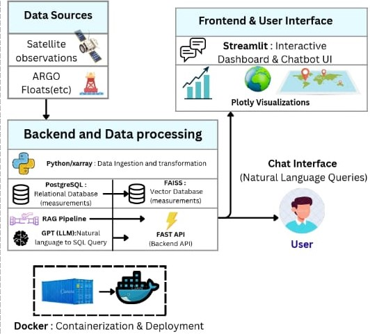

# 🌊 ARGO-AI: Intelligent Ocean Data Visualization Platform

**ARGO-AI** is an interactive web application for exploring and analyzing **real-time oceanographic data** from **Argo floats** around the world.  
It combines advanced **data visualization**, **3D mapping**, and an **AI-powered chatbot** to help scientists, researchers, and ocean enthusiasts understand global ocean conditions like temperature, salinity, and pressure.

---

## 📖 Table of Contents
- [🌊 Project Overview](#-project-overview)
- [✨ Features](#-features)
- [🧠 Tech Stack](#-tech-stack)
- [🏗️ System Architecture](#️-system-architecture)
- [⚙️ Installation](#️-installation)
- [🚀 Usage](#-usage)
- [📂 Folder Structure](#-folder-structure)
- [🔮 Future Enhancements](#-future-enhancements)
- [👥 Contributors](#-contributors)
- [📜 License](#-license)

---

## 🌊 Project Overview

**ARGO-AI** bridges the gap between complex oceanographic data and intuitive insights.  
By integrating **real-time Argo float data**, a **3D global map**, and a **natural language chatbot**, the platform enables users to visualize trends, explore underwater topography, and query datasets through simple interactions.

This project is designed for:
- Oceanographers and climate researchers  
- Environmental data analysts  
- Educational institutions  
- Anyone curious about ocean data trends 🌎

---

## ✨ Features

- **📊 Interactive Dashboard** – View real-time oceanographic parameters (temperature, salinity, pressure) through rich charts and analytics.  
- **🗺️ 3D Global Ocean Map** – Explore float positions and underwater topography using Three.js.  
- **🤖 AI Chatbot Assistant** – Ask questions about Argo data, trends, or regional statistics powered by OpenAI API.  
- **⚙️ Data Processing Backend** – Python-based backend (FastAPI/Flask) handles API requests, preprocessing, and chatbot responses.  
- **📡 API Integration** – Seamlessly connects to official Argo APIs and AI endpoints.  
- **💾 Real-Time Updates** – Automatically refreshes data to reflect the latest Argo measurements.  
- **🌐 Responsive Web Design** – Optimized UI for desktop and mobile users.

---

## 🧠 Tech Stack

**Frontend:**
- TypeScript  
- React.js  
- Three.js (3D visualization)  
- D3.js / Chart.js (data visualization)  
- TailwindCSS or Material UI (styling)

**Backend:**
- Python  
- FastAPI or Flask  
- Pandas / NumPy (data processing)  
- OpenAI API (chatbot integration)  
- Argo API (ocean data retrieval)

**DevOps / Tools:**
- Docker  
- Git & GitHub  
- Node.js  
- Vite / Webpack  
- VS Code

---

## 🏗️ System Architecture

The following diagram illustrates the overall architecture of **ARGO-AI**, showing data ingestion, backend processing, AI integration, and frontend visualization.



### 🔍 Architecture Overview

- **Data Sources:** Argo floats and satellite observations provide continuous measurements (temperature, salinity, pressure, etc.).  
- **Backend and Data Processing:**  
  - `Python / xarray` for ingestion and transformation.  
  - `PostgreSQL` stores relational measurements.  
  - `FAISS` provides a vector database for semantic search.  
  - `RAG Pipeline` converts natural language queries into SQL or analytical results via GPT.  
  - `FastAPI` exposes APIs for data and chatbot interactions.  
- **Frontend (Streamlit):** An interactive dashboard and chatbot UI with Plotly visualizations.  
- **Chat Interface:** Users can interact with the system using natural language queries.  
- **Docker:** Handles containerization and deployment of backend and frontend services.

---
## ⚙️ Installation

### 1️⃣ Clone the Repository
```bash
git clone https://github.com/AnishSonar1234/ARGO-AI.git
cd ARGO-AI
```
### 2️⃣ Package installation
```bash
cd backend
python -m venv venv
source venv/bin/activate   # On Windows: venv\Scripts\activate
pip install -r requirements.txt
```
```bash
cd ../frontend
npm install
```
